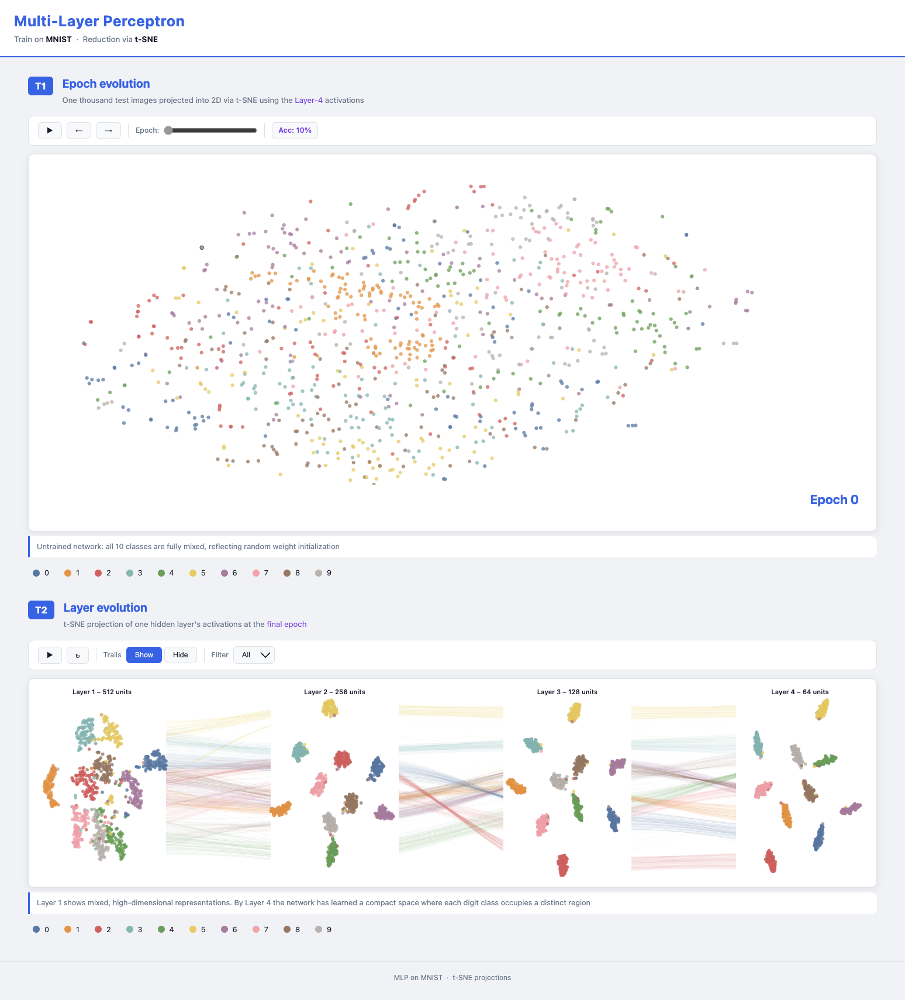

# Visual Learning Models

Interactive visualization of how a Multi-Layer Perceptron learns to classify handwritten digits (MNIST).

---

## Setup

```bash
pip install -r requirements.txt
python data/data.py
python app.py            
```

MNIST is downloaded automatically to `./mnist/` on first run.

---

## Visualization



---


## Project structure

```
├── app.py               # Flask server
├── data/
│   ├── data.py          # ML pipeline: train → extract → t-SNE → JSON
│   ├── epochs.json      # T1 data (inter-epoch projections)
│   └── layers.json      # T2 data (inter-layer projections)
├── templates/
│   └── index.html
└── views/
    ├── styles.css
    ├── epochs.js        # T1 visualization
    └── layers.js        # T2 visualization
```

---

## Visualizations

### T1 — Inter-Epoch Evolution
t-SNE projection of **Layer-4 (64-unit)** activations for 1 000 MNIST test images, tracked across 6 training snapshots: epochs 0, 1, 2, 5, 10, 20.

- **Play / Prev / Next** — animate or step through epochs
- **Slider** — jump to any epoch directly
- **Scroll** — zoom and pan the scatter plot
- **Click** a point or legend item — isolate that digit class
- **Hover** — tooltip with digit class and point ID

### T2 — Inter-Layer Evolution
Four t-SNE scatter plots (one per hidden layer) at the final trained epoch, arranged side by side. Cubic-Bézier **trails** connect each observation across all four layers.

- **Animate Trails** — reveal trails layer by layer
- **Show / Hide** — toggle trail visibility
- **Filter dropdown / legend click** — isolate a digit class
- **Hover** a point — highlights its full trajectory across all layers

---

## ML pipeline (`data/data.py`)

| Step | Detail |
|---|---|
| Model | MLP · 784 → 512 → 256 → 128 → 64 → 10 (ReLU, CrossEntropy, Adam) |
| Dataset | MNIST · 1 000 balanced test samples (100 per class) |
| Extraction | Activations from all 4 hidden layers at epochs 0, 1, 2, 5, 10, 20 |
| Projection | t-SNE (perplexity 30, 1 000 iterations, PCA init) |
| Alignment | Procrustes rotation applied across epochs/layers for stable transitions |

---

## Design Rationale

**Projection — t-SNE** preserves local neighbourhood structure, making cluster formation visible. PCA would lose non-linear structure critical for deep representations. Procrustes alignment ensures smooth, spatially meaningful transitions between epochs and layers.

**Color — Tableau-10** provides 10 perceptually distinct colors, one per digit class. Consistent encoding across both views lets users transfer their color–class mapping instantly.

**T1 uses Layer-4** because it is the most discriminative representation before the classification decision — it shows the full journey from random noise to structured clusters.

**T2 uses trail bundling** because 1 000 raw lines would be unreadable. Cubic-Bézier curves attracted toward class centroids group co-class trajectories into coherent flows, reducing clutter while preserving structural insight.

**Interactions follow the Visualization Mantra:**
- *Overview first* — all 1 000 points and all 4 layers visible on load
- *Zoom / Filter* — scroll-to-zoom, drag-to-pan, click-to-isolate-class
- *Details on demand* — hover reveals digit class, point ID, and epoch/layer context
